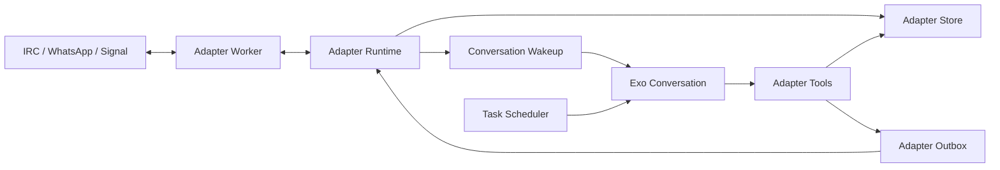
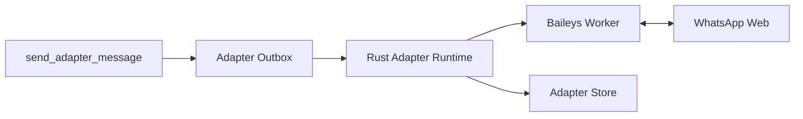
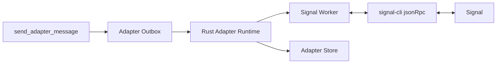

# Exo Adapter Architecture

Exo adapters are host-owned long-running integrations between an Exo
conversation and an external application. The first adapter is IRC, but the
same worker shape now supports ExoChat, IRC, WhatsApp, and Signal, and is intended to
support Slack, Discord, IRC networks, and custom local services.

Adapters are deliberately not scheduled sandbox tasks. A scheduled task is a
periodic command: it starts, runs, writes output, wakes the conversation, and
exits. An adapter owns a live external connection: it keeps sockets open,
responds to protocol keepalives, reconnects after errors, parses inbound
messages, records event history, and wakes a conversation when something should
be handled by the agent.

## Components

The implementation is split across a few small executor and CLI modules:

- `exoharness/crates/executor/src/adapter/types.rs` defines durable adapter records,
  source enums, generic worker config, event records, and outbound message records.
- `exoharness/crates/executor/src/adapter/store.rs` is the file-backed store under
  `.exo/adapters`. It stores adapter records, per-adapter event history, and
  the adapter outbox.
- `exoharness/crates/executor/src/adapter/runtime.rs` supervises enabled worker adapters,
  writes event artifacts, sends conversation wakeups, and queues outbound
  messages.
- `exoharness/crates/executor/src/adapter/worker.rs` implements the generic JSONL worker
  bridge used by host-supervised sidecar adapters.
- `exo/adapters/irc/worker.ts` implements IRC connection behavior:
  TLS/plain TCP, `PASS`/`NICK`/`USER`, `JOIN`, `PING`/`PONG`, `PRIVMSG`
  parsing, trigger matching, and draining outbound messages over the persistent
  IRC connection.
- `exo/adapters/whatsapp/worker.ts` is the Baileys worker for the
  library WhatsApp adapter.
- `exo/adapters/signal/worker.ts` is the `signal-cli` worker for
  the library Signal adapter.
- `exoharness/crates/executor/src/adapter/tools.rs` implements the host-backed tool calls
  used by Exo.
- `exoharness/typescript/harness/adapter-tools.ts` exposes the model-facing Exo tools.
- `exoharness/crates/cli/src/adapters.rs` provides `exo --harness exo adapters ...`.
- `./exo.sh` starts the adapter runner next to the scheduler.

At a high level:



## Durable Records

Adapter state lives under `.exo/adapters`:

- `.exo/adapters/adapters/<adapter-id>.json` contains the `AdapterRecord`.
- `.exo/adapters/events/<adapter-id>/*.json` contains lifecycle, inbound,
  outbound, and error event records.
- `.exo/adapters/outbox/<adapter-id>/*.json` contains queued outbound messages
  waiting for the long-running adapter connection to send them.

The key record is `AdapterRecord`:

- `id`: stable adapter id used by tools and scheduler report prompts.
- `agent_id` and `conversation_id`: the owning Exo agent/conversation.
- `name`: human-friendly adapter name.
- `source`: `built_in` or `library`.
- `enabled`: disabled adapters preserve history but stop receiving.
- `config`: worker config, including adapter type, command, initialization JSON,
  optional state dir, and optional secret environment bindings.
- `last_connected_at_ms`, `last_error`: runtime status fields.

## Tool Surface

Exo exposes these adapter tools:

- `create_adapter`: create and enable an adapter.
- `list_adapters`: list adapters for the current conversation.
- `disable_adapter`: stop receiving while preserving history.
- `delete_adapter`: remove adapter state and event history.
- `send_adapter_message`: request an explicit outbound send.

All adapter tools are conversation-scoped. Rust derives the current `agentId`
and `conversationId` from the active handles, then verifies that the requested
adapter belongs to that conversation.

## IRC Adapter Example

An IRC adapter can be created from the REPL with arguments like:

```json
{
  "name": "libera-test",
  "source": "built_in",
  "config": {
    "type": "irc",
    "server": "irc.libera.chat",
    "port": 6697,
    "tls": true,
    "nick": "exo12345",
    "username": "exo12345",
    "realname": "Exo Test Bot",
    "channel": "##exo12345",
    "passwordSecretId": null,
    "trigger": "mention"
  }
}
```

The IRC worker connects to the server, sends optional `PASS`, then `NICK` and
`USER`, waits for IRC welcome numeric `001`, joins the configured channel, and
keeps the socket open. It responds to `PING` with `PONG` so the server does not
disconnect it.

For each channel `PRIVMSG`, the worker applies the trigger policy:

- `mention`: wake the conversation only if the message mentions the bot nick.
- `all_messages`: wake the conversation for every channel message.

The `mention` default is important. Busy channels can generate many messages,
and waking the model for every line would be noisy and expensive.

When a message matches, the worker emits a JSONL `message` event. The Rust
runtime writes an inbound artifact containing the target, sender, text, metadata,
adapter id, and timestamps. It also records an inbound event, then wakes the
owning conversation with a user message that includes the adapter id:

```text
irc message received at target `##exo12345` from spooky via adapter `libera-test`:

hello @exo12345

Use send_adapter_message with adapterId `...` if you should reply to IRC.
```

The agent decides whether to respond. There is no automatic model-output-to-IRC
bridge.

## Worker Protocol

ExoChat, IRC, WhatsApp, and Signal are implemented as Node.js workers. Rust launches each
worker with:

- `EXO_ADAPTER_ID`
- `EXO_ADAPTER_TYPE`
- `EXO_ADAPTER_STATE_DIR`
- `EXO_ADAPTER_CONFIG`, a JSON object containing adapter-specific initialization
- any secret-derived environment variables declared by the worker config

Worker communication is newline-delimited JSON:

- Worker to Rust: `connected`, `message`, `lifecycle`, `error`, and
  `disconnected`.
- Rust to worker: `send_message` with `target` and `text`.

This keeps protocol code in Exo while preserving one host-owned supervision,
event, wakeup, and outbox implementation in Rust.

## WhatsApp Worker Example

The WhatsApp adapter uses the same durable adapter store and runtime lifecycle as
IRC, with protocol-specific work in a Node.js worker:



The worker is launched with:

```bash
pnpm tsx exo/adapters/whatsapp/worker.ts
```

If `authDir` is not configured, auth state is stored under the worker state dir's
`auth` subdirectory. On first connection the worker emits a `lifecycle` event
named `qr`; scan that QR with WhatsApp to pair the account. After pairing, the
worker emits `connected` and then `message` events for text messages.

For inbound WhatsApp messages, the runtime writes an artifact with the chat id,
sender, message id, and text, then wakes the conversation. The wakeup instructs
the agent to call `send_adapter_message` with both the adapter id and WhatsApp
`target` chat id when a reply is appropriate.

The MVP is intentionally narrow: text messages only, one worker per WhatsApp
account/session, QR pairing through logs/artifacts, and no media handling or
message edits yet.

## Signal Worker Example

The Signal adapter follows the same worker bridge but delegates protocol work to
`signal-cli`:



The worker is launched with:

```bash
pnpm tsx exo/adapters/signal/worker.ts
```

If `account` is not configured, the worker runs `signal-cli link`, prints a
linked-device QR code to the adapter log, discovers the linked account with
`signal-cli listAccounts`, then starts `signal-cli -a <account> jsonRpc`. Signal
CLI state is stored under the worker state dir's `signal-cli` subdirectory unless
`configDir` is set.

For inbound Signal messages, the runtime writes an artifact with the sender,
target, text, message id, and metadata, then wakes the conversation. Outbound
Signal messages require a `target`: use a Signal username with the `u:` prefix,
a phone number, a UUID, a group id, or the target from an inbound wakeup.

## Outbound Messages

Adapter sends must be explicit and auditable. When the agent calls
`send_adapter_message`, the tool does two things:

1. Writes an outbound event for history.
2. Writes an `AdapterOutboundMessageRecord` into the adapter outbox.

The long-running adapter runtime drains that outbox once per second and sends
queued messages to the worker as `send_message` commands. The IRC worker sends
them as `PRIVMSG` over the already-connected IRC socket. The WhatsApp worker
sends them through Baileys. The Signal worker sends them through `signal-cli`
JSON-RPC. WhatsApp and Signal messages require an outbox `target`; IRC messages
do not because the destination channel is fixed in adapter config.

WhatsApp and Signal also support outbound rich attachments on `send_adapter_message`.
Attachments specify exactly one HTTPS `url`, base64 `data` payload, or
`sandboxPath` and a `kind` of `image`, `video`, `audio`, or `document`. Use
`sandboxPath` for files created inside the agent sandbox; the host tool copies
the file into `.exo/adapters/media` before queueing the outbound send. URL and
inline-data attachments are also size-checked and staged by the host before
they reach adapter workers. Image, video, and document WhatsApp attachments use
the message text as the first caption-capable media caption. Documents also
require `mimeType` and `fileName`.

The outbox also decouples conversation turns from socket ownership. The model
turn can finish after queueing a message; the adapter runtime owns the external
connection and sends when it is ready.

## Adapter Runner Lifecycle

The adapter runner is started by:

```bash
./target/debug/exo --harness exo adapters run --limit 50
```

`./exo.sh` starts this automatically unless `--no-adapters` is
provided. It also records a pid file at `.exo/exo-adapters.pid`.

The runtime periodically lists enabled adapters and starts one supervision task
per adapter. Each supervision task:

1. Loads the latest adapter record.
2. Skips disabled or not-yet-built adapters.
3. Connects and runs the adapter loop.
4. Records connection events and errors.
5. Reconnects after failures with a short delay.

Disabling or deleting the adapter causes the loop to stop on its next store
check or reconnect cycle.

## Cooperation With The Scheduler

The scheduler and adapter runtime cooperate through the conversation, not by
calling each other directly.

When a user says in IRC:

```text
exo12345: every minute, fetch BBC headlines and post them here
```

the flow is:

1. The IRC adapter receives the message and wakes the Exo conversation.
2. The agent decides to create a scheduled task with `schedule_sandbox_task`.
3. The task stores normal scheduler state under `.exo/scheduled-tasks`.
4. The agent includes external routing in the task `reportPrompt`, including the
   `adapterId` and, for WhatsApp or Signal, the `target`.
5. The scheduler runner executes the task when it is due.
6. The scheduler writes a task result artifact and wakes the conversation.
7. The scheduler wakeup includes the task `reportPrompt`, stdout/stderr preview,
   artifact id, and run metadata.
8. The agent follows the `reportPrompt` and calls `send_adapter_message`.
9. `send_adapter_message` queues an outbox record.
10. The adapter loop drains the outbox and posts the result to the external app.

The important bridge is the task `reportPrompt`. Scheduled tasks are generic;
they do not know that they were created from IRC unless the agent records that
intent. For IRC-originated scheduled work, the report prompt should say something
like:

```text
Summarize the headline output and send it back using send_adapter_message with
adapterId 019e... . For WhatsApp, include target 123@s.whatsapp.net. For Signal,
include target u:example.01 or the inbound target. Keep the message under 400
chars.
```

This keeps side effects explicit. The scheduler wakes the agent with the result,
and the agent performs the external send through the adapter tool.

## Background Credentials

Scheduler wakeups are model turns, so the scheduler process needs access to the
same model credentials as the REPL. On macOS, secrets may be encrypted with a
master key stored in Keychain. Background processes can fail with secure storage
errors until Keychain access is approved.

For local testing, running the scheduler once in a normal terminal and choosing
"Always Allow" in the macOS prompt lets future background runs decrypt the model
secret and post scheduled task results back to IRC.

## Source Model

Adapters mirror the tool source model:

- `built_in`: core adapter implementations shipped as host-native Exo
  behavior. IRC is currently the only built-in adapter.
- `library`: reusable adapters shipped with Exo or loaded from manifest
  metadata. WhatsApp and Signal are library adapters backed by shipped workers.
- `agent`: adapter modules written or installed by the agent at runtime.

The current runtime runs built-in IRC plus library WhatsApp and Signal adapters
as host-supervised workers. Module-backed library and agent adapters are persisted
and build-validated so the registry boundary is in place; a future module runner can
implement the same host-owned lifecycle and outbox semantics without changing the
model-facing tools.

## Operational Notes

- Use short IRC nicks. Networks often reject long nicks during registration.
- Prefer `trigger: "mention"` for public or busy channels.
- `send_adapter_message` queues outbound messages; the adapter runner must be
  active for them to reach the external app.
- WhatsApp `send_adapter_message` calls must include the inbound chat id as
  `target`.
- Signal `send_adapter_message` calls must include a Signal username, phone
  number, UUID, group id, or inbound target.
- If scheduled results do not appear in IRC, check scheduler run records first.
  The adapter may be healthy while the scheduler wakeup is failing.
- `disable_adapter` is the safe stop operation because it preserves history.
  `delete_adapter` removes the adapter and event/outbox state.
